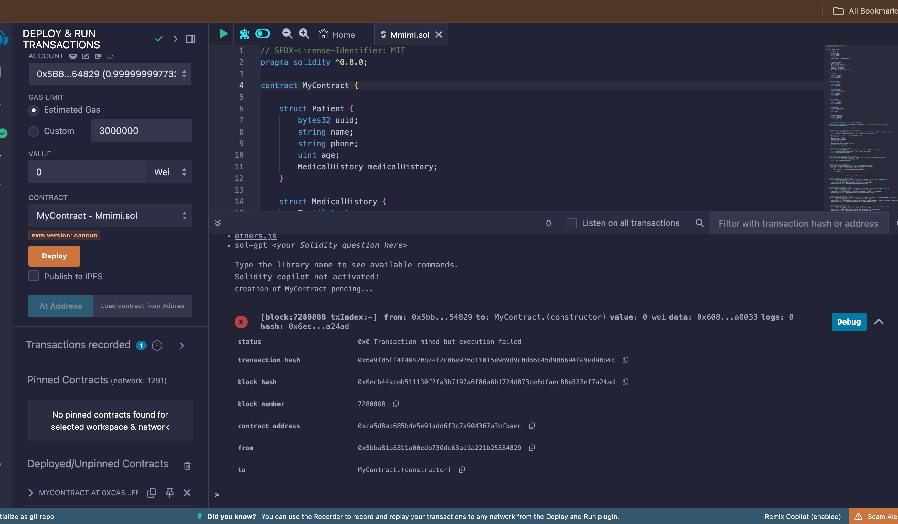
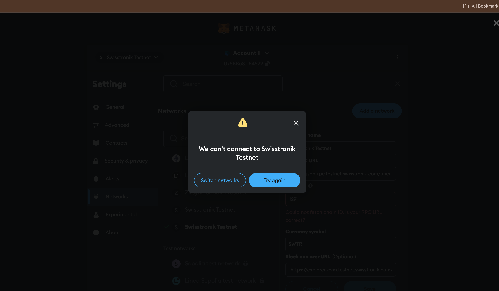

# Blockchain & Telecom Integration Project

## Introduction

This project integrates **Solidity** for Ethereum smart contracts, **Web3.js** for blockchain interaction, **Africa's Talking API** for SMS and USSD services, and **CradleVoices SMS API** for communication services. The goal is to create a decentralized application (dApp) that communicates via SMS and USSD while interacting with Ethereum smart contracts, offering secure transactions and decentralized services with the convenience of traditional telecom platforms.

## Benefits

- **Blockchain & Telecom Integration**: This project bridges blockchain technology with traditional telecommunication services.
- **Secure and Transparent**: Ethereum smart contracts ensure tamper-proof and secure transactions.
- **Wide Accessibility**: SMS and USSD enable users with basic phones to interact with the blockchain.
- **Decentralized**: No central authority or third party controls the interaction between the user and the blockchain.
- **Cost-effective and Scalable**: Using APIs like Africa's Talking and CradleVoices allows scalability and cost-efficiency in sending messages and handling USSD services.

## Technologies Used

- **Solidity**: A programming language used to write smart contracts that run on the Ethereum blockchain.
- **Web3.js**: A JavaScript library that allows you to interact with the Ethereum blockchain via smart contracts.
- **Africa's Talking API**: Provides SMS and USSD capabilities to interact with users via mobile phones.
- **CradleVoices SMS API**: A tool used to send bulk SMS for communication purposes.
- **Hardhat**: A development environment for compiling, testing, and deploying Ethereum smart contracts.

## Project Features

- **Decentralized Application (dApp)** that interacts with the Ethereum blockchain.
- **SMS and USSD integration** for user interaction with smart contracts.
- **SMS Notification** for key actions via CradleVoices API.
- **Blockchain Interaction** through Web3.js, ensuring that users can interact with the deployed smart contract seamlessly.
- **Africa's Talking** used for the USSD interface to allow users with non-smartphones to interact with the platform.

## How to Run the Project

### Prerequisites
Ensure that you have the following installed:
- **Node.js** (v14 or later)
- **npm** (Node package manager)
- **Hardhat** (for Solidity development)
- **Git** (for version control)

### Steps to Run

1. **Clone the Repository**:
   ```bash
   git clone <repository_url>


## Challenges Faced

### Issues with Swisstronik Network

While attempting to deploy and interact with the smart contract using the **Swisstronik network**, we encountered several challenges that hindered our progress. Below are the key issues faced:

1. **Error During Contract Interaction**: 
   - When trying to interact with the contract, we consistently encountered the following error:
     ```
     Error while interacting with contract: Error: Encryption error. Reason: bad p size
     at encryptDataFieldWithPublicKey (/path/to/project/node_modules/@swisstronik/utils/build/cjs/tx.js:24:15)
     at SWTRMiddleware.processRequest (/path/to/project/node_modules/@swisstronik/web3-plugin-swisstronik/lib/SWTRMiddleware.js:27:98)
     at process.processTicksAndRejections (node:internal/process/task_queues:95:5)
     ```

2. **Account Balance Insufficiency**:
   - Despite having a small amount of ETH (approximately **0.0275 ETH**), we faced issues related to contract interaction and signing due to what seemed to be encryption errors, possibly related to Swisstronik’s middleware.

3. **Failure to Sign Contract**:
   - The most critical challenge was the failure to properly sign the contract. Even after troubleshooting multiple times, the encryption-related issues remained unresolved, which prevented the smooth deployment and interaction with the contract on the Swisstronik network.

Given these persistent errors, we decided to **switch to a local network** for development and testing purposes to bypass the encryption and signing issues experienced on the Swisstronik network.

### Workaround: Local Network

To continue development without interruptions, we opted to deploy and test the smart contract on a **local Ethereum network**. This allowed us to bypass the encryption issues, ensuring that our Web3 interactions functioned correctly and contracts were signed without error. Using a local network provided a smoother and more controlled environment for testing, without the complexities introduced by the Swisstronik plugin.

For future iterations, we plan to explore further solutions or updates to the **Swisstronik web3 plugin** to potentially resolve the encryption and signing issues for production deployment.





### Devs Who Helped

We want to thank the following developers who helped overcome the technical challenges:
-SantiagoDevRe (GitHub)  
-codescolls (GitHub)  

---

## Important Links

- [YouTube Video Demonstration](https://youtu.be/p44KUs9n604)
- [Google Slides Presentation](https://docs.google.com/presentation/d/1-WaLYL7FYwSbKnIf-VHaF7hqDPuFkmWSB43X1mGo8OA/edit?usp=sharing)
- Follow us on Twitter: [colls_codes](https://twitter.com/colls_codes)

---